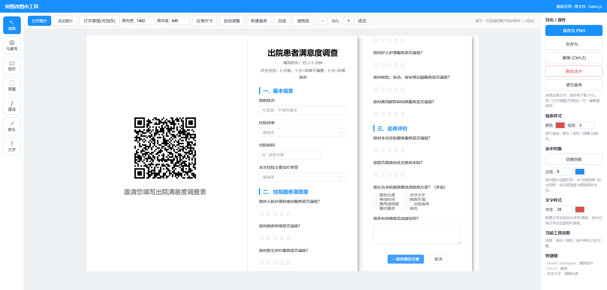

# 拼图改图小工具

> 一个轻量、离线、开箱即用的图片标注与拼图工具，特别适合公众号运营、手机截图拼接、敏感信息打码等日常场景。



## 为什么做这个小工具

在写公众号文章、整理手机截图时，我常常遇到这些麻烦：

- 截图里有二维码、手机号、姓名等敏感信息，需要快速打马赛克；
- 想把两三张手机截图拼成一张横排图，PS 太复杂，在线工具要上传隐私图；
- 好不容易拼好图，结果画布四周空出一大截，还得手动改尺寸。

于是我做了这个「拼图改图小工具」：**一个 HTML 文件，双击即用，完全离线，所有图片都在本地浏览器处理，不上传任何服务器。**

## 功能特性

| 功能 | 说明 |
|------|------|
| **打开 / 添加图片** | 「打开」清空画布重新初始化；「添加」在现有画布上追加，适合拼图 |
| **原图尺寸导入** | 所有图片默认以原始尺寸导入，同机截图进来就是一样大 |
| **智能横排排版** | 一次选择多张图片，自动横排平铺，免去手动拖拽 |
| **拖拽 + 缩放** | 选中图片即可拖动、四角缩放、旋转，操作直观 |
| **画布缩放** | 支持 `−` / `+` / `100%` / `适应窗口`，不影响导出清晰度 |
| **自动调整画布** | 一键按所有对象包围盒裁掉右侧和底部空白 |
| **马赛克** | 框选区域即可像素化打码，可移动、可删除 |
| **标注工具** | 矩形、圆形、直线、箭头、文字 |
| **文字样式** | 支持设置字号和颜色 |
| **边框与阴影** | 选中图片可一键加投影，可设置描边宽度和颜色 |
| **覆盖原文件保存** | 用「打开原图(可回存)」打开的单图，可直接覆盖原文件 |
| **离线使用** | Fabric.js 已打包在本地，断网也能运行 |

## 适用场景

- 公众号文章配图：手机截图拼接、打码、画框标注重点
- 产品体验报告：多张界面图并排 + 箭头说明
- 日常工作汇报：给系统截图打马赛克后直接发群
- 任何需要在本地快速处理、不想上传隐私图片的场景

## 技术栈

- HTML5 Canvas
- [Fabric.js](http://fabricjs.com/)（已本地打包，无需联网）
- 纯前端实现，零后端、零依赖安装

---

## 操作手册

### 一、快速开始

1. 克隆或下载本仓库；
2. 进入 `screenshot-tool` 目录；
3. 双击 `index.html`，用 Chrome / Edge 打开即可。

或者起一个本地静态服务（推荐）：

```bash
cd screenshot-tool
python -m http.server 8765
# 然后浏览器访问 http://127.0.0.1:8765/
```

> ⚠️ 推荐使用 **Chrome 或 Edge** 浏览器。覆盖原文件保存功能依赖 File System Access API，Firefox 暂不支持，会自动降级为下载。

### 二、核心操作流程

#### 场景 A：给单张截图打马赛克并覆盖保存

1. 点击顶部 **「打开原图(可回存)」**，选择需要处理的截图；
2. 左侧工具栏选择 **「马赛克」**，在敏感区域拖拽框选；
3. 如需标注，可切换「矩形」「圆形」「直线」「箭头」或「文字」工具；
4. 点击右侧 **「覆盖原文件」**，直接保存回原路径。

#### 场景 B：把多张手机截图横排拼成一张图

1. 点击顶部 **「打开图片」**，一次性选择所有要拼的截图；
2. 图片会自动以原始尺寸横排摆放；
3. 用「选择」工具拖动微调位置；
4. 点击 **「自动调整」** 裁掉画布右侧和底部的空白；
5. 点击 **「保存为 PNG」** 导出。

#### 场景 C：在已有图片基础上追加其他图片

1. 点击 **「添加图片」** 或直接把图片拖入画布；
2. 新图片以原始尺寸加入，默认带阴影；
3. 拖动排布后，点「自动调整」裁空白即可。

### 三、界面说明

**顶部工具栏**

| 按钮 | 作用 |
|------|------|
| 打开图片 | 清空画布，按原图尺寸打开新图片；多选时自动横排排版 |
| 添加图片 | 在当前画布中追加图片，不重置已有内容 |
| 打开原图(可回存) | 打开图片并记住文件句柄，保存时可一键覆盖原文件 |
| 画布宽 / 画布高 | 手动设置画布尺寸，点「应用尺寸」生效 |
| 自动调整 | 按所有对象的外接矩形自动裁掉右侧和底部空白 |
| 新建画布 | 清空画布，使用当前设置的画布尺寸 |
| 白底 / 透明底 | 切换导出背景 |
| − / + / 100% / 适应 | 画布视图缩放，仅影响显示，不影响导出尺寸 |

**左侧工具栏**

| 工具 | 作用 |
|------|------|
| 选择 | 选中、移动、缩放、旋转对象 |
| 马赛克 | 拖拽框选区域进行像素化打码 |
| 圆 | 绘制圆形标注 |
| 直线 | 绘制直线 |
| 箭头 | 绘制带箭头的线段 |
| 文字 | 添加文字，双击可编辑 |

**右侧面板**

- **导出/操作**：保存为 PNG、另存为、撤销、删除选中、清空画布
- **线条样式**：设置矩形、圆、直线、箭头的描边颜色和粗细
- **选中对象**：切换阴影、设置边框宽度与颜色
- **文字样式**：设置字号和颜色
- **当前工具说明**：实时提示当前工具的用法

### 四、快捷键

| 快捷键 | 作用 |
|--------|------|
| `Delete` / `Backspace` | 删除选中对象 |
| `Ctrl + Z` | 撤销 |
| `Esc` | 取消当前绘制 / 取消选中 |

### 五、注意事项

1. **离线可用**：`fabric.min.js` 已随项目打包，无需联网即可运行。
2. **覆盖原文件**：仅当通过「打开原图(可回存)」打开的图片才支持覆盖保存；普通「打开图片」和拖拽添加的图片默认走下载，防止误覆盖。
3. **浏览器兼容性**：覆盖保存需要 Chrome / Edge 的 File System Access API。其他浏览器仍可正常使用除覆盖保存外的全部功能。
4. **原始尺寸导入**：大图原始尺寸可能很大，可配合顶部「适应」按钮先缩放视图，再排版。

---

## 开源协议

[MIT](./LICENSE)
